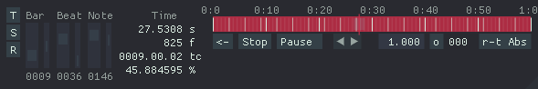

# ofxPlayhead

**ofxPlayhead is `ofGetElapsedTime()` on steroids.**

## Description

This utility class basically provides a playhead position with playback capabilities and time accessors for your compositions.
It implements functionality from both sequencers, DAW metronoms, clocks, timelines, and players.
It's meant to replace the usage of ofGetElapsedTime() to provide an interactive "player" experience in your ofApps.

I have used this utility both for exporting frame-by-frame animations (with a real-time editor) and for running and editing real-time compositions.

## Features:

- Time is calculated+cached once per frame.
- Determined or infinite composition duration (loopable).
- Clock : provides time references for your animations.
- Metronom : counters and utilities.
- Playback modes : Real-time (time-based) or Offline (frame-based).
- Playback controls : Play/Pause/Stop/Speed/Frame-Navigation.
- Sequencing : You can register to events to be notified of metronom events.
- XML save+restore object settings using PugiXml.
- GUI : An **optional** ImGui widget to control and visualise the timeline.

_Note: The term "timeline" sometimes refers to editors for animations in time. There's no timeline animation features build-in ofxPlayhead._

## Setup

- Download and install this addon as any other ofxAddon.
- If you with to use the embedded GUI layer, you need [ofxImGui/develop](https://github.com/jvcleave/ofxImGui/tree/develop) and compile with `-DofxAddons_ENABLE_IMGUI`.

## Examples

Example-imgui uses ofxImGui by default, but you can disable it by removing `ofxAddons_ENABLE_IMGUI` from `config.make` and removing `ofxImGui` from `addons.make`.

## Known issues:

- There's 2 real-time playback modes. The "rt-Abs" one is experimental and has broken seeking abilities.
- The tDelta times are not perfect yet : there's a sync issue in offline + rt-Abs modes when seeking.

## Future directions

- In rt mode: Ability to choose/align with either the theorhetical exact frame time or the real-time moment on the closest frame.
- Ableton Link integration for synching the playhead with other apps ?